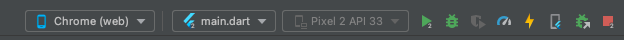
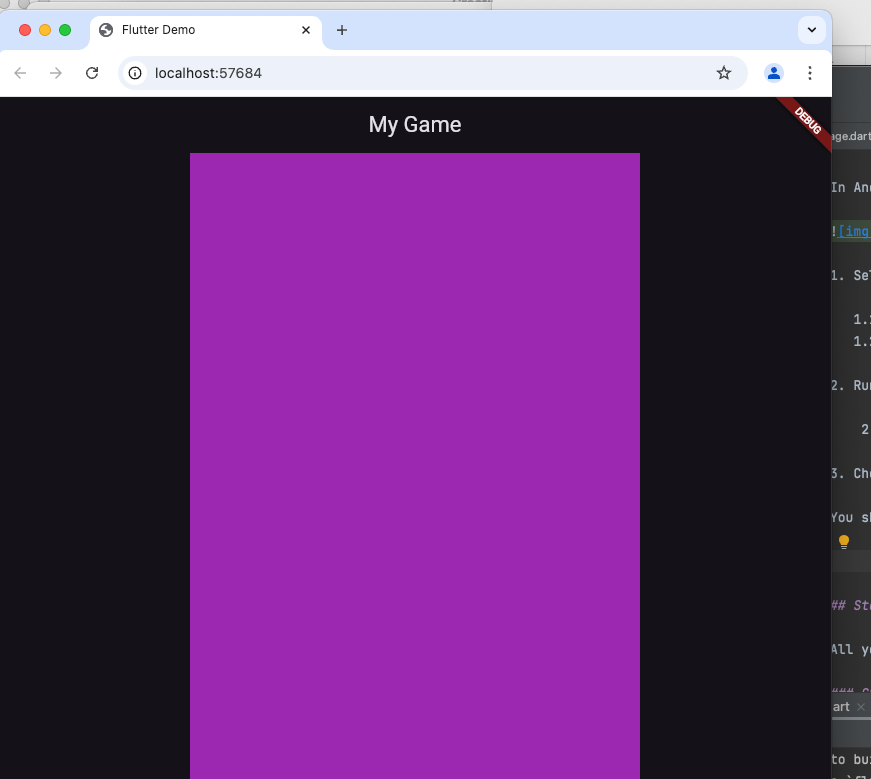
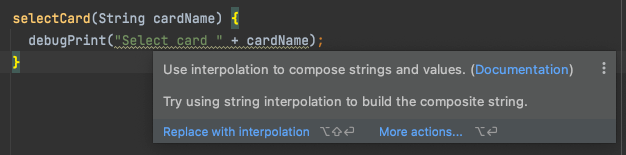
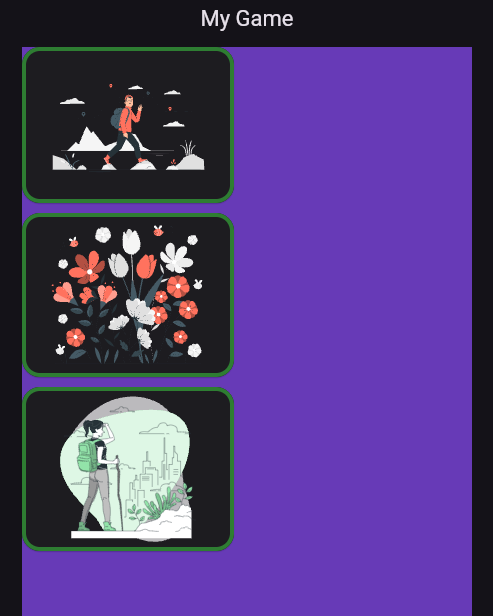
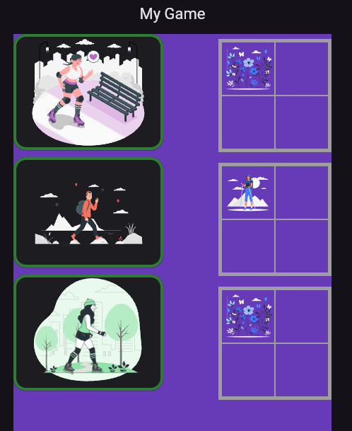
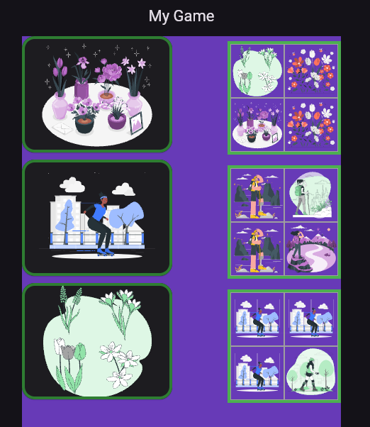

# mobile_game

A workshop for beginners, where you get to build your own flutter game

## About Flutter

Flutter is a programming language that runs... anywhere! But most importantly, you can run
it on your mobile phone.

In this workshop, we'll provide you with the scaffolding to write your first flutter code. 

# Setup

Before you start, you need a working developer environment with flutter, and a copy of the code
for the workshop.

This might have been done for you, TODO how to check

If not, here is how to set up a working development environment for this workshop 
https://github.com/fflowio/mobile-game/blob/main/README_SETUP.md

# Code

When you start this workshop, you already have an IDE open. At the left-hand side is a list
of files, there are a lot. But there is good news, you can ignore most of them!

## Flutter-generated files

Flutter comes with lots of files that support the way your code works with a phone. They are 
generated for you every time you create a new flutter project. For this workshop, you don't need
to worry about them.

## Folders, files and other structure

When you write a code project, it generally ends up being quite long. You'll notice there are 
already a lot of files, and you haven't even started yet! But if all the code was in one
single file, it would look even messier.

Developers tidy and structure their code by splitting it up. It's a bit like writing a book, or
even a series of books. There's no absolute rule about where and how to split up your code, but
in my head, it goes a bit like this:

| Code                | Literature   |
| ------------------- | ----------   |
| Folder / directory  | Book         |
| File                | Chapter      |
| Method / function   | Paragraph    |
| ------------------- | ----------   |

A method, also called a function, is generally related to a single thought or action, with several 
methods in a file, and several files in a folder.

In this workshop, you will work on several functions, all in the game.dart file.

## Workshop files

We have provided files which give you a framework and some useful helper functions, and a game
file where you will write your code.

They are all in the lib/ folder, as follows:

- lib/main.dart
- lib/views/game.dart [here is where you will work]
- lib/views/credits.dart
- lib/components/widgets.dart
- lib/components/image_helpers.dart

You'll find out more about them in the workshop.

## Run the blank project

Run the project. There isn't much to see yet, that's because you will be coding it in the next steps.
But let's just see the blank project first!

### VSCode

TODO F5 instructions

### Android Studio

In Android Studio, at the top of the screen, in the middle you'll see some menus. The look like this:



1. Run the game
   1.1 Select run options
      1.1.1 Chrome(web) in the first menu
      1.2.2 main.dart in the second menu 

   1.2 Run
       1.2.1 Click on the green triangle next to the third menu

   1.3 Check it's all working

You should see something like this:



## Coding Context

At the top of game.dart, you'll see some imports, these are helpful functions you'll need later on.

Next come two classes:

```class Game extends StatefulWidget {```
and
```class _GameState extends State<Game> {```

State is the way a mobile app remembers information between one click and the next. Without it,
everything would always go back to the beginning and start again. 

The second class, _GameState, has two methods:

TODO signatures of game() method
and
```
@override
Widget build(BuildContext context) {
```

@override means there's code inherited from flutter that does things for you, for example the
AppBar.

All your code will be written in lib/views/game.dart. We will tell you which method to use to make your
changes, or when it's a good idea to create a new method.

To find a method, look for round brackets () and the squirly brackets {} like this:

```
methodName() {
}
```

The round brackets () hold parameters, information that you will pass into the method.
The squirly brackets {} mark the beginning and end of the code that happens in the method.

Most of your code will go inside a method, that is, between { and } for a method()

Methods need to go inside a class, which also has { and }

Let's get started.

### Name

2. Choose a name

Find this line in the build() method:
```
title: const Text("My Game")
```
  2.1 Change "My Game" to your chosen name for the game

As soon as you save, you should see the browser now shows your chosen name.

Congratulations, you've just written your first line of code!

### Background color

  2.2 Choose a background color for your game

Find this line in the game() method:

```
color: Colors.deepPurple,
```

   2.2.1 Change Colors.deepPurple to Colors.green
   2.2.2 Change it again, from Colors.green to Colors.deepOrange

Did you notice anything while you were typing? Your IDE started helping you, by telling you what 
colours it knows about.

Try a few different colours.

We're using dark mode for this app, which means it will have white text, so it's best to use a dark 
background.

### Comments

  2.3 Comments

    2.3.1 Comment out the color line, like this:

```
// color: Colors.purple,
```

All programming languages have a way of writing comments, usually so that you can explain what's
happening to other developers. Comments are also useful to remove some code temporarily.

What happened when you commented the color line?

Keep it commented for now, so that the page is plain black. We're about to start putting content on 
the page, and a black background will work well. You'll have a chance to add colours back later on.

## Welcome

3. Welcome

Let's start with a welcome page. 

  3.1 Add this new method inside the _GameState class

```  
  Column welcome() {
    return Column(
      children: [
        const SizedBox(height: 50),
        ImageHelpers.getPicture("assets/images/StoryboardAmico.svg", 300),
        const SizedBox(height: 50)
      ]
    );
  }
```

You'll see that nothing changes in the screen. Why not? Because, in order to run the code in a 
method, you need to call it.

It needs to be part of the contents of the Container in the game() method, and flutter does this
with the child keyword, which you will use in the code below.

Look in the game() method, it returns a Container. 

   3.2 Edit the previous line:
    ```constraints: const BoxConstraints(maxWidth: 450)```
   add a comma at the end so it looks like this:
   ```constraints: const BoxConstraints(maxWidth: 450),```

   3.3 Add this new line below the comma:
   ```child: welcome()```

The result should look like this!


## 4. Start playing

The app needs a button to get the game started.

In the welcome() method you just created

4.1 Add a start button

4.1.1 What's with all these commas?

You're using commas quite a bit in this workshop, and here's a mini explanation. 

Use square brackets to identify the contents of the list. 

Many programming languages use the square brackets, and most of them call it an Array, in flutter
and dart it's called it a List.

[a, b, c, d]

To add another entry in the list, you could do this:

[a, b, c, d, e]

Or, when the contents get a bit longer, and to help see where each entry starts, you can split 
the contents over different lines:

[
  apple,
  banana,
  cherry,
  dinosaur,
  elephant
]

Which is what happens with the code in this workshop! Let's do it now.

4.1.2 Add a comma

Add a comma to the last SizedBox in the welcome method, like this:

```const SizedBox(height: 50),```

If you look around, you'll see it's in a list of things inside square brackets [ ]

4.1.3 Add a start button

```Widgets.defaultButton(resetGame, "Start")```

Your IDE will show up with an error immediately! Why? What have you done?

You've told the app to add a button with a label "Start", and when you press it, it calls a method
"resetGame". But there is no resetGame method, or not yet! Add it now.

4.1.4 Add reset game method

A new method goes inside the _GameState class, but outside any other methods. It's a good idea to
put an empty line above and below every new method, so you can see where it starts and finishes.

The order of methods doesn't matter, but it helps to keep related methods nearer to each other.
When these instructions say "near", add the new code above or below the nearby method.

Add this near the game() method.

```
void resetGame() async {
  debugPrint("Reset");
}
```
This fixes the error, and you should have a green Start button now. What happens when you press it?

4.1.5 Debug

Look at the foot of your screen, in the console. In Android Studio, make sure it's on the Run tab
(TODO VS Code)

The method doesn't do anything yet - but you know it's working, because in the Run console, you 
see the word Reset.

That's because you added a line of debug, using the flutter call debugPrint. 

Developers use debug to work out what's going on in their code, and what's going wrong. Typically,
you turn off debug statements for production users. But at the moment, you're the only person seeing
this code, and debug statements are useful. 

We'll add a couple more in the workshop. Also, any time something doesn't work, you can add your
own debugPrint output.

4.2 Start the game

Time to get the game started!

At the moment, the game() method always returns the welcome page. Let's change it to return the 
game page when the user starts it.

4.2.1 Add pageContents() 

Add a new method:

```
  Widget pageContents() {
    if (_showContents == "start") {
      return gamePage();
    } else {
      return welcome();
    }
  } 
```

The IDE will show two errors now! Can you guess why?

Your code mentions two new things, _showContents, and gamePage(), and they don't exist yet. You 
will add them next.

By the way, it's absolutely normal to see errors while you work on code. They look scary, especially
if they are bright red. This workshop shows you some on purpose so that you get used to them. And
the debugPrint you have already seen is a useful way to work out what's wrong.

4.2.2 Call the new pageContents() method

In the build() method, change the Container child so it returns pageContents() instead of welcome(),
like this:

```child: pageContents()```

The page contents don't actually change yet, because you haven't change the value of _showContents.
You'll do that next.

4.3 Manage _showContents

Flutter uses _ to mark something as private. The app already has one private method, _GameState. 
Private just means you can only call it from inside the same class. 

We use private methods and variables to stop data from leaking into other bits of the app.

Although this showContents is a private variable, we want to use it in several different methods
in this class. If you declare a variable inside a method, only that method can use it. 

We want to use showContents in several methods, so it needs to be declared outside all of them.

By convention, we add class-wide variables at the top of the class, so anyone new to the class will
see them quickly.

At the top of the (private) _GameState class, above all the methods, add this line:

```String _showContents = "welcome";```

This should fix one error, but there's still one more.

4.4 Add gamePage()

Add the gamePage method near the pageContents and welcome methods, like this:

```
Row gamePage() {
  debugPrint("Game");
  
  return Row(
    mainAxisAlignment: MainAxisAlignment.spaceBetween,
    children: [
      Text("Game contents go here")    
    ]
  );
}
```

All the errors should be fixed, but there are still warnings. Ignore them for now, you will fix
them soon.

4.5 _showContents logic

You have code for two different bits of content: gamePage() and welcome(). But at the moment,
you can still only see the welcome page. Which is nice, but it would be handy to see the game
page too.

How do you fix this? 

First, let's try changing the value of _showContents

4.5.1 Change _showContents 

In the resetGame() method, add this line at the bottom:

```_showContents = "start";```

But... nothing happens!

What has gone wrong?

Remember the debugPrint? It's still there, and it shows you did call the resetGame() method,
each time you click the start button. (It's a good idea to check this, sometimes the
reason code isn't working is simply that you are not calling it.)

But debug shows you did call it, and there must be a different problem. 

4.5.2 Set _showContents in state

You don't just want to the change the value of _showContents, you also want to redraw the page 
contents. In flutter, the way to get the page to redraw is to change the state. 

Change the line you just added so that it sets the value of _showContents not just as a variable, but also in 
the app state, like this:

```setState(() => _showContents = "start");```

4.5.3 Does it work?

Click the Start button again. Now it should work, and you see the "Game contents go here" text.

In the rest of this workshop, when you call a method, if it doesn't exist, you get
an error. But here, there's no error, and it just starts working. But you haven't written
a setState() method. How does this happen?

Look at the top of the class, it looks like this:

```class _GameState extends State<Game> {```

The State class you are extending includes the setState() method, which is why you don't need to 
build it. Someone else already built and supplied it to us!

It's called inheritance - you inherited the setState method from the parent State class.

This is why inheritance is so powerful. It means you can reuse your own or someone else's code.

5. Game page

Let's get some contents in the game page.

5.1 cards to choose

5.1.1 Call cardsToChoose

In the pageContents() method, change the Text line to call cardsToChoose()

    ```cardsToChoose()```

5.1.2 Implement cardsToChoose

  Near the pageContents() method, add a new cardsToChoose() method

```
  Column cardsToChoose() {
    return Column(
      children: [
        ImageHelpers.randomPictureLink(selectCard),
        const SizedBox(height: 10),
        ImageHelpers.randomPictureLink(selectCard),
        const SizedBox(height: 10),
        ImageHelpers.randomPictureLink(selectCard)
      ]
    );
  }

```
Oops, the errors are just getting worse! You fixed the cardsToChoose() error, but now there are
three selectCard errors instead. 

Take a quick look in the image_helpers.dart file at the randomPictureLink method. A helpful
comment at the top says you need to provide a selectCard method. You'd better do that now!

5.2 selectCard

Add the selectCard() method now, near the cardsToChoose() method

```
selectCard(String cardName) {
  debugPrint("Select card " + cardName);
}
```

5.2.1 Fix the warning

Your IDE will give you a warning about using String interpolation. String interpolation syntax
can be a bit fiddly, but luckily, we don't need to worry about the details!

Hover over the String line, the IDE will offer a helpful message, like this:



Click on 

```Replace with interpolation```

Once it's fixed, it should look like this:

```debugPrint("Select card $cardName");```

If the IDE magic doesn't work, you can fix it by hand.

5.3 Does it work?

Your app should look like this now!



Remember the image generator is random, so your images will be different. But the layout should
be the same as this screenshot.

Look in the run tab for helpful debug, you should see a message like this:

"Select card assets/images/ImageName.svg"

The images are all in the assets/images folder. Thanks and credits to https://storyset.com

6. Game logic

6.1 Sets

The game player is trying to build sets of matching cards.

Configure the sets where they will be stored

Like _showContents, they need to be private, and shared with all the methods in the class.

6.1.1 Set variables

Add these sets near the _showContents variable, at the top of the _GameState class

```
List<String> _set1 = [];
List<String> _set2 = [];
List<String> _set3 = [];
```

6.2 Set logic

Add a new cardCanGoInSet() method near the categoryMatch() and selectCard() methods.

The images we're using come in sets of 4, so a set in the game will have a maximum size of 4.

6.2.1 Can you add a card to a set?

Let's start with the basics: if the set size is 0, the new card can go in it. If it's 4, the new
card can't. If it has 1,2, or 3 cards, you need some more logic, which you'll add soon. For now,
just add a debug statement.

```
bool cardCanGoInSet(String cardName, List<String> set) {
  if (set.isEmpty) {
    return true;
  } else if (set.length == 4) {
    return false;
  } else {
    debugPrint("Set has 1 or more cards");
    return false;
  }  
}  
```

6.3 More set logic

6.2.1 Add card to next available set

Add a new method addCardToNextAvailableSet(), near the cardCanGoInSet() and selectCard() methods.

```
  addCardToNextAvailableSet(String cardName) {
    //debugPrint(cardName);
    if (cardCanGoInSet(cardName, _set1)) {
      _set1.add(cardName);
    } else if (cardCanGoInSet(cardName, _set2)) {
      _set2.add(cardName);
    } else if (cardCanGoInSet(cardName, _set3)) {
      _set3.add(cardName);
    } else {
      debugPrint("CARD DOES NOT FIT ANYWHERE");
    }
  }
```

6.2.2 Call the new method

In the selectCard() method, add this line:

  ```addCardToNextAvailableSet(cardName);```

This might be working now, but you can't really tell. You could start by adding debugPrint to check, 
or just skip on and start to display the sets:

7. Wallet

7.1 Wallet contents

The app currently only uses the left-hand side of the view. This means we can add the wallet in the
right-hand side.

Near the gamePage() method, add a new method that shows the set contents

```
Column wallet() {
  List<Widget> contents = [
    Widgets.setContainer(_set1),
    const SizedBox(height: 8),
    Widgets.setContainer(_set2),
    const SizedBox(height: 8),
    Widgets.setContainer(_set3)
  ];

  return Column(
    mainAxisAlignment: MainAxisAlignment.start,
    children: contents
  );
}
```

7.2 Call the wallet

Call the new wallet() method from the gamePage() method, 

Add a comma after cardsToChoose(), and then this line:

```wallet()```

7.3 Set state

The wallet code is working, you can see it shows a grid where the cards will be added, so it's
getting called. But it's not displaying the cards from the set contents. Why not?

It's the state problem again!

After you update the sets, you need to update them in the widget state, so it knows to include 
them when it redraws.

7.3.1 Set state

You could add this in the addCardToNextAvailableSet() method. But that one is going to get
pretty full of logic so to keep it a bit easier to read, we'll add it to the place that calls it.

In selectCard(), under addCardToNextAvailableSet(), add this:

    setState(() {
      _set1;
      _set2;
      _set3;
    });

7.4 Test the wallet

Now the wallet updates with the cards from the set! It should look something like this:



It's working, but, because we only added logic to add the first card to any set, they only 
ever have one. Go back to the set logic to add cards 2, 3, and 4

8 More set logic

8.1 Just add them all

In cardCanGoInSet() method, in the last else statement, there's a debug and you return false, 
which means you don't allow the card to go in the set.

What happens if you change it to true?

```return true;```

Now you can fill up the sets to get to 4, but ... they aren't matching sets. 

You need more logic to make sure they match.

8.2 Card category match

In order to belong in a set, a card needs to be from the same category.

Add a new categoryMatch() method near the selectCard() method

```
bool categoryMatch(existingCard, newCard) {
  return existingCard.substring(14, 21) == newCard.substring(14, 21);
}
```

If you want to understand how this method works in more detail, add debug. For example:

```debugPrint(existingCard.substring(14, 21));```

8.3 Call the card category match

In the cardCanGoInSet() method, inside the last else statement, test the category to make the 
decision about whether to return true or false. Add this:

```
      if (categoryMatch(set[0], cardName)) {
        return true;
      } else {
        return false;
      }  
```

8.4 Does it work?

Now, the card you select should only join a set if it matches. And you should be able to fill up
all the sets, like this!



9.0 Winning

But wait, the game never ends. It just keeps trying to add cards, and noping out, because all the
sets are full.

9.1 Too many sets

The logic we're about to add applies to all the sets. If you look in the addCardToNextAvailableSet()
method, it's already got some if statements that basically do the same thing for each set. Those
statements are about to get longer, and it's starting to look messy.

Instead, we'll make a minor refactor and keep track of all the sets together.

9.1.1 List of Lists

When you have a list, captured between square brackets: [ a, b, c ]

It turns out, you can use a list inside a list, like this: [[a,b,c], [b,c,d], [f,g,h]]

We're going to do this with our sets.

9.1.2 Add a sets list

At the top of the GameState class, add a new sets list near the other sets 

```List<List<String>> _sets = [];```

You can try changing the line you just added:

```List<List<String>> _sets = [_set1, _set2, _set3];```

... but you'll get errors! The instance member can't be accessed in an initializer

Basically, it just means it's too soon to add those contents.

Go back to the first version.

9.1.3 Add the sets to the bigger list.

Instead, set up the sets when we reset the game

Add this line into resetGame()

```_sets = [_set1, _set2, _set3];```

9.2 For loop

In the addCardToNextAvailableSet() method, use a for loop instead of checking each set specifically.

Change the contents of the method to this:

```
    for (var set in _sets) {
      if (cardCanGoInSet(cardName, set)) {
        set.add(cardName);
        return;
      }
    }
```    

9.2.1 Does it work?

With any refactor, even a minor one, check everything still works the same way it did before.

9.3 fullSets variable

Near the _set variables at the top of the class, add a new private fullSets variable

```int _fullSets = 0;```


In the addCardToNextAvailableSet() method, if you just added the 4th card, update the full set count

Under set.add(cardName, add this:

```
      if (set.length == 4) {
        _fullSets += 1;
      }
```

9.4 When are all the sets full?

In the selectCard() method, at the end, check if the sets are full, and if they are, change 
to the finish page (which doesn't exist yet, but we'll get to that)

```
    if (_fullSets == 3) {
      setState(() => _showContents = "finish");
    }
```

9.4.1 Does it work?

Sort of.

If you run the game until all the sets are full, it ... goes back to the welcome page!

Why?

Look at the logic in pageContents()

It only ever calls either the game page or the welcome page. You need to update it to call a 
finish page. Let's build the contents first.

9.5 Finish page

9.5.1 Add the finish page

Near the pageContents() method, Add a new finishPage() method to congratulate the player

```
  Widget finishPage() {
    String result = "You completed " + _fullSets.toString() + " sets!";

    List<Widget> children = [
      const SizedBox(height: 40),
      Text(
        "Congratulations!!",
        style: Widgets.celebrateTextStyle
      ),
      Text(result, style: Widgets.subTextStyle),
      const SizedBox(height: 40),
      Widgets.defaultButton(resetGame, "Play again"),
      const SizedBox(height: 40)
    ];

    children += (Credits.contents());

    return Column(
      children: children
    );
  }
```

9.5.2 Fix the warning

Do you remember using the IDE to help fix the interpolation warning?

Use the same trick again, and your code should change to this:

```String result = "You completed $_fullSets sets!";```

9.6 Call the finish page

In the pageContents() method, between the top if and the bottom else, add an else-if test, like this:

```
    } else if (_showContents == "finish") {
      return finishPage();
```

9.6.1 Does it work?

Run the game through, do you get to the new finish page?

Excellent!

But at the moment, every player will win, every time.

Let's fix that next.

10. Coins

10.1 Count coins

There's already a coin widget in the navbar, but at the moment, it always says "40".

Let's make it more intelligent.

10.1.1 Coins variable

At the top of the class, where we declare _sets and _fullSets, add a line with the coins variable

```int _coins = 120;```

10.1.2 Update coins

Every time the user selects a card, subtract some coins. In the selectCard() method, add this:

```_coins -= 10;```

10.1.3 Check when the user runs out of coins

Better check in case we got to zero!

In the same selectCard() method, after subtracting coins, test how many are left:

```
  if (_coins == 0) {
    setState(() => _showContents = "finish");
  }
```

10.1.4 Remove the old fullSets check

This means we don't need the fullSets check any more. It's not doing any harm, but it's always
a good idea to remove code you don't need any more. It means there's potential for something
to break, and it can confuse someone reading this code for the first time.

Delete these lines:

``` 
  ~~
    if (_fullSets == 3) {
      setState(() => _showContents = "finish");
    }
  ~~  
```

10.1.5 Display coins

Show the user how their coins are going: in the build() method at the end of the class, find
where the customNavBar is called, and update it to coins:

```Widgets.customAppBar(_coins),```
